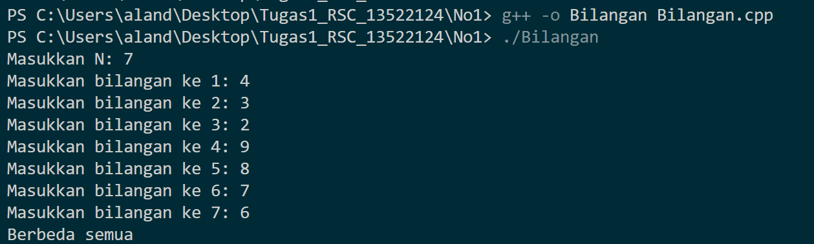
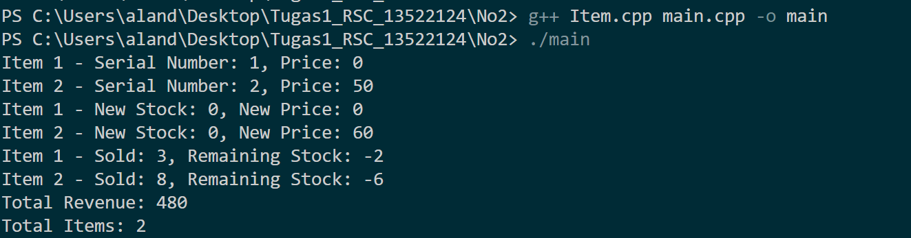

# Tugas1_RSC_13522124
> Implementasi sederhana konsep Object Oriented Programming (OOP) dalam bahasa pemrograman C++

🎓 **Latar Belakang:**
Repository ini dibuat untuk memenuhi kewajiban tugas individu mengenai version control dan OOP dalam menempuh pendidikan sebagai Calon Robotics Software Control dalam Aksantara ITB 2024.

## 📝 Tugas Wajib
### Nomor 1
Buatlah program yang pertama menerima bilangan asli N. Kemudian menerima input N buah bilangan bulat. Program akan menampilkan apakah N bilangan yang dimasukkan ini berbeda semua atau tidak. Kedua format input pada contoh 1 dan 2 boleh dipakai. (Tips: Alokasikan array secara dinamis).

Contoh 1:
```
Masukkan N: 5
4 3 1 0 2
Berbeda semua
```
Contoh 2:
```bash
Masukkan N: 4
Masukkan bilangan ke 1: 3
Masukkan bilangan ke 2: 17
Masukkan bilangan ke 3: 17
Masukkan bilangan ke 4: 100
Tidak berbeda semua

```

### Nomor 2
Dalam sebuah toko, kelas **Item** merepresentasikan sebuah barang yang dijual di toko tersebut dengan jumlah stok yang tersedia **stock** dan harga barang sebesar **price**. Kelas **Item** menyimpan berapa banyak barang yang telah didaftarkan (**totalItems**) dan catatan total penghasilan dari penjualan semua barang (**totalRevenue**).
```bash
// Item.hpp

#ifndef __ITEM_HPP__
#define __ITEM_HPP__

class Item {
private:
	int stock;						// Jumlah stok item
	int price;						// Harga item
	int sold;						// Jumlah item yang terjual. Diawali dengan 0.
	const int serialNum;			// Nomor serial item sesuai urutan pendaftaran item

public:
	static int totalRevenue;		// Total penghasilan dari penjualan semua item
	static int totalItems;			// Jumlah item yang telah didaftarkan

	Item();
	/* kontruktor default: stok adalah 0 dan harga barang adalah 0 */
	
	Item(int stock, int price);
	/* kontruktor dengan parameter */

	~Item();
	
	int getSerialNum() const;
	int getSold() const;
	int getPrice() const;

	void addStock(int addedStock);
	/* Menambahkan stok item. Tidak akan bernilai negatif. */
	void sell(int soldStock);
	/* Menjual item. Jika item tidak cukup, maka item terjual hanya sampai stok item habis */
	void setPrice(int newPrice);
};

#endif
```

## 📝 Tugas Bonus
Diberikan potongan kode berikut;
```bash
typedef struct {
   float X; /* absis   */
   float Y; /* ordinat */
} POINT;

void Geser_1 (POINT *P, float deltaX, float deltaY){
    (*P).X += deltaX;
    (*P).Y += deltaY;
}

POINT Geser_2 (POINT P, float deltaX, float deltaY){
    P.X += deltaX;
    P.Y += deltaY;
    return P;
}
```
a) Apa yang dimaksud pointer?

b) Jelaskan perbedaan prosedur void Geser_1 dan fungsi POINT Geser_2!

c) Apabila Geser_1 tidak menggunakan pointer, apa yang akan terjadi??

## 📁 Struktur Program
```bash
Tugas1_RSC_13522124
├─ No1/
│  └─ Bilangan.cpp
├─ No2/
│  ├─ Item.hpp
│  └─ Item.cpp
├─ Bonus/
│  └─ Bonus.pdf
└─ README.md
```

## Screenshots

<div align="center">
  
  <p><i>Uji Coba Program Nomor 1</i></p>
</div>

<div align="center">
  
  <p><i>Uji Coba Program Nomor 2</i></p>
</div>